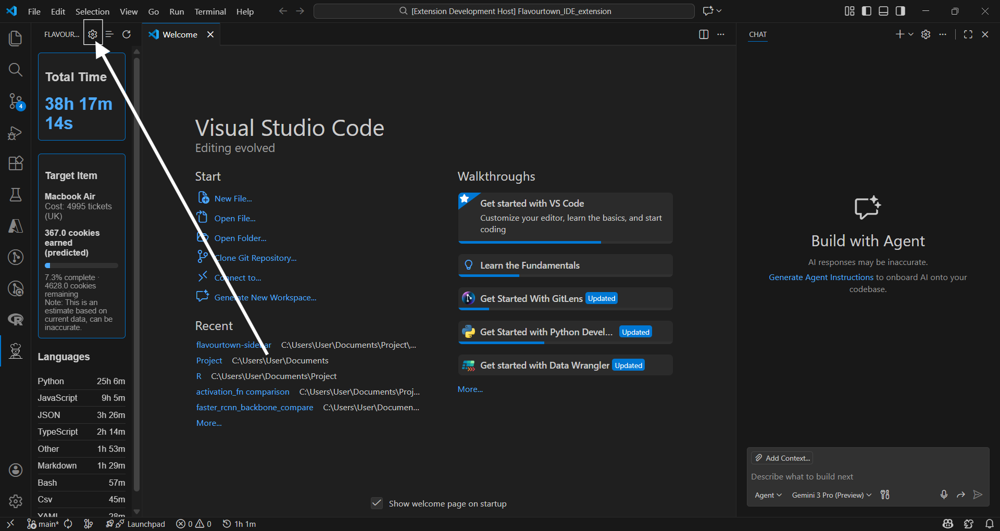
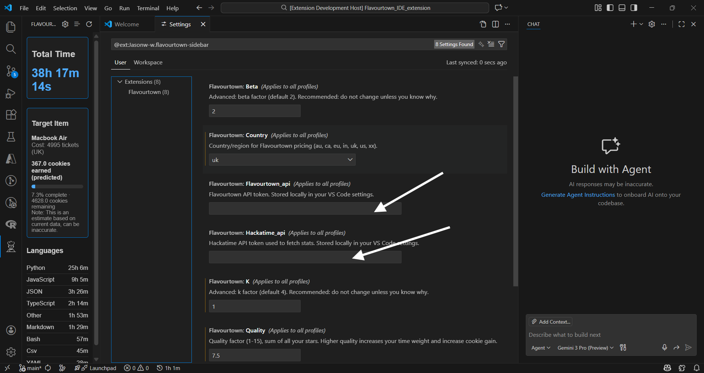
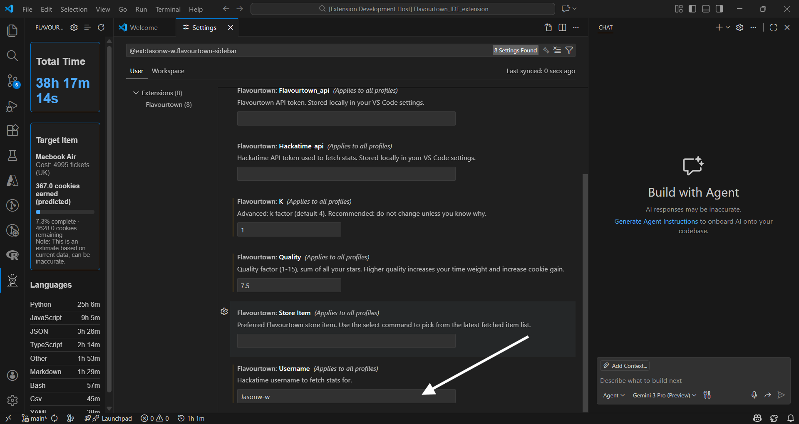
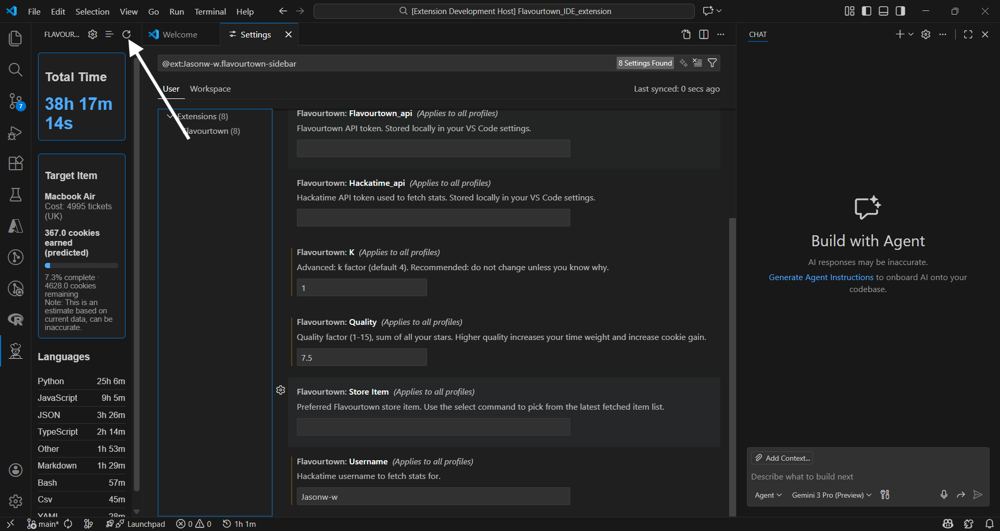
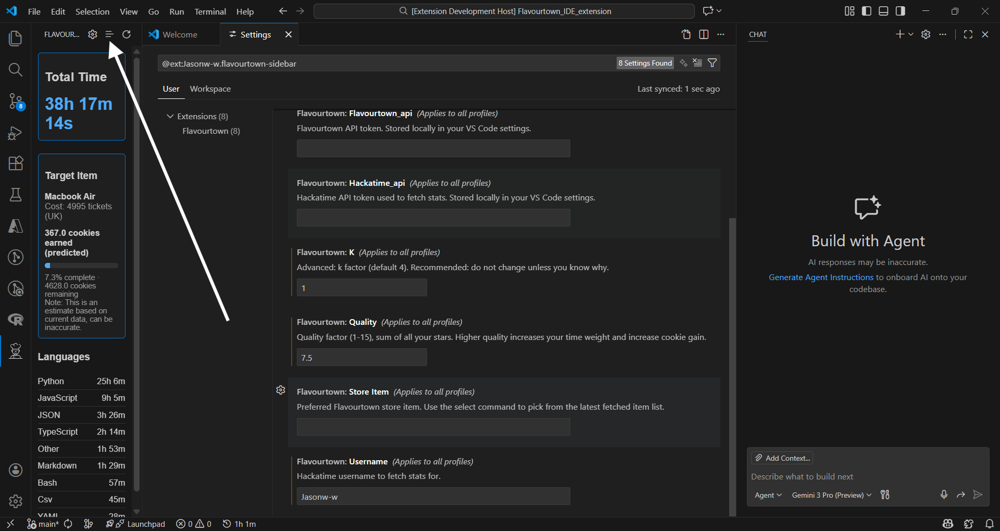

# Flavourtown Time Tracking (VS Code Extension)

Shows your daily coding stats and progress toward your target item.

## Setup
1) set up Hackatime api

log in to [Hackatime settings](https://hackatime.hackclub.com/my/settings)
 ,then go to setup time tracking

then look for your api key and copy it to a safe place

2) set up Hackatime Username

log in to [Hackatime settings](https://hackatime.hackclub.com/my/settings)

then copy your Username, or set one up if you havent (don't forget to press save!!!)

3) set up Flavourtown api

log in to your flavourtown account and go to setting 

look for your API key

copy it to a save place

4) install the extension

go to your vscode's sidebar and look for extension, then search for Flavourtown-sidebar, then press install

5) set up extension
press on the gear icon
paste your apis
enter your Hackatime Username
press refresh
dont forget to set your target!!!
Congradulations!!! You are all set!

## Troubleshooting
- If data is empty: ensure Python is installed and the API key/username are set; run `python python_scripts/get_data.py` to see errors.
- If prices are missing: run `python python_scripts/get_targets.py` to refresh `storage/ft_store.json`.

## Privacy
API tokens are stored in your VS Code user settings and sent only to Hackatime/Flavourtown to fetch your data. Remove keys from settings to revoke access.