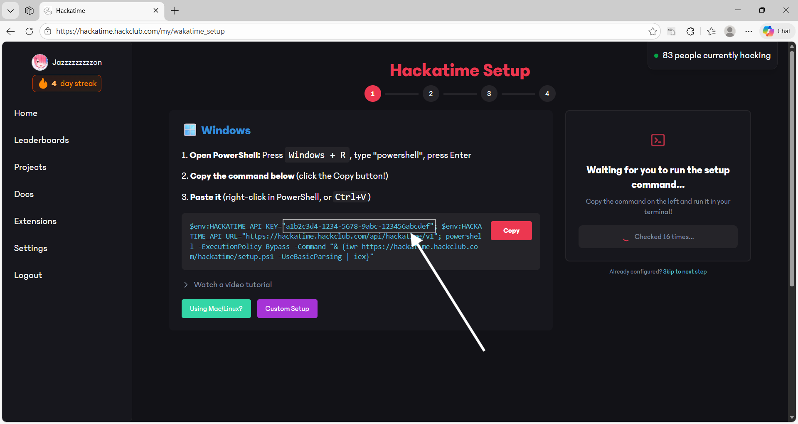
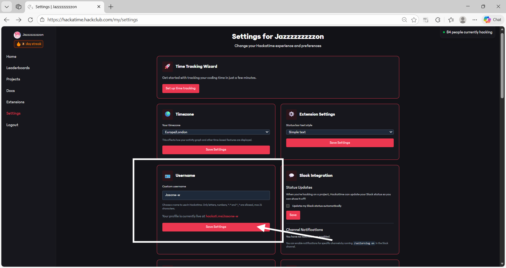
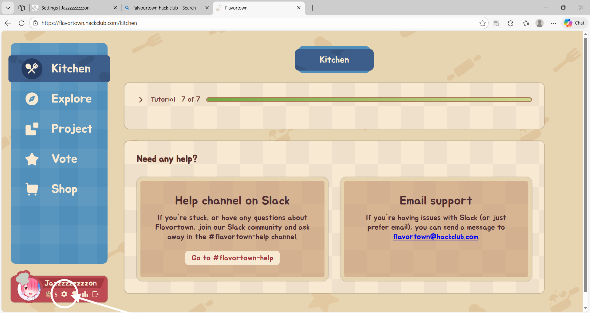
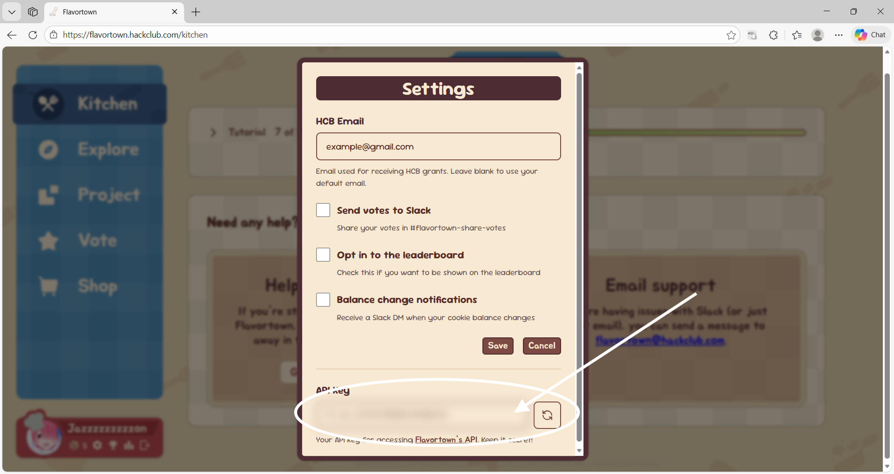
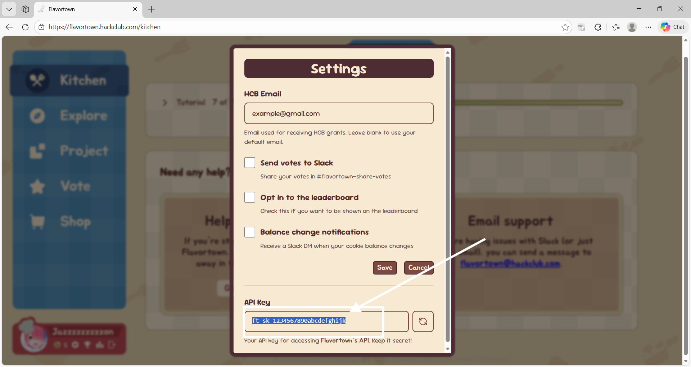

# Flavourtown Time Tracking (VS Code Extension)

Shows your daily coding stats and progress toward your target item.

## Setup
1) set up Hackatime api

log in to [Hackatime settings](https://hackatime.hackclub.com/my/settings)
 ,then go to setup time tracking

then look for your api key and copy it to a safe place

2) set up Hackatime Username

log in to [Hackatime settings](https://hackatime.hackclub.com/my/settings)

then copy your Username, or set one up if you havent (don't forget to press save!!!)

3) set up Flavourtown api

log in to your flavourtown account and go to setting 

look for your API key

copy it to a save place
