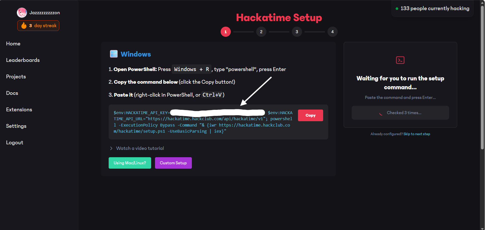

# Flavourtown Time Tracking (VS Code Extension)

Shows your daily coding stats inside VS Code using Hackatime data.

## What it does

- Adds a **Daily Stats** sidebar view.
- Reads stats from `storage/stats.json`.
- Includes a refresh button to reload the latest data.

## Find Ur API and Username(for .env file):

Username:

1) log on to hackatime and go to setting (<a href="https://hackatime.hackclub.com/my/settings">Hackatime settings</a>)

2) look for username(create one and press "save setting" if you havent got one.)

API_KEY:
1) log on to hackatime and go to setting (<a href="https://hackatime.hackclub.com/my/settings">Hackatime settings</a>)

2) at the top look for "set up time tracking button"

3) This is your api key:
 
 copy it and save it somewhere

## Requirements

- Node.js + npm
- Python 3.x (for the helper script that fetches Hackatime stats)

## Setup (development)

1) Install JS dependencies:

```bash
npm install
```

2) Install Python dependencies:

```bash
pip install -r requirements.txt
```

3) Create a `.env` in the project root (next to `package.json`):

```env
HACKATIME_API_KEY=your_token_here
HACKATIME_USERNAME=your_username_here
```

## Run the extension

Start the TypeScript/esbuild watcher:

```bash
npm run watch
```

Then in VS Code:

- Press `F5` (Run Extension)
- Open the Flavourtown view (Activity Bar) → **Daily Stats**

## Generate stats

This extension expects a JSON file at:

- `storage/stats.json`

Generate it by running:

```bash
python python_scripts/get_data.py
```

Then click the refresh button in the sidebar.

## Troubleshooting

- **“No stats yet” / file not found**
	- Run `python python_scripts/get_data.py` to generate `storage/stats.json`.
- **Auth errors / empty data**
	- Verify your `.env` has valid `HACKATIME_API_KEY` and `HACKATIME_USERNAME`.
- **Debugging**
	- Open **Debug Console** and look for logs starting with `[Flavourtown]`.

